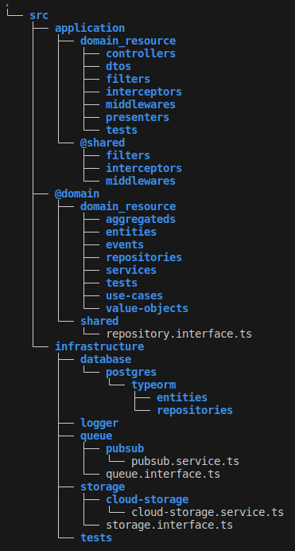
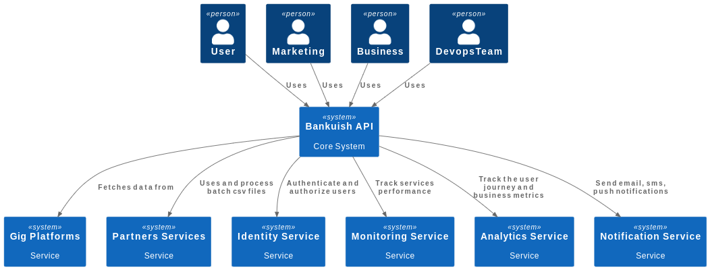
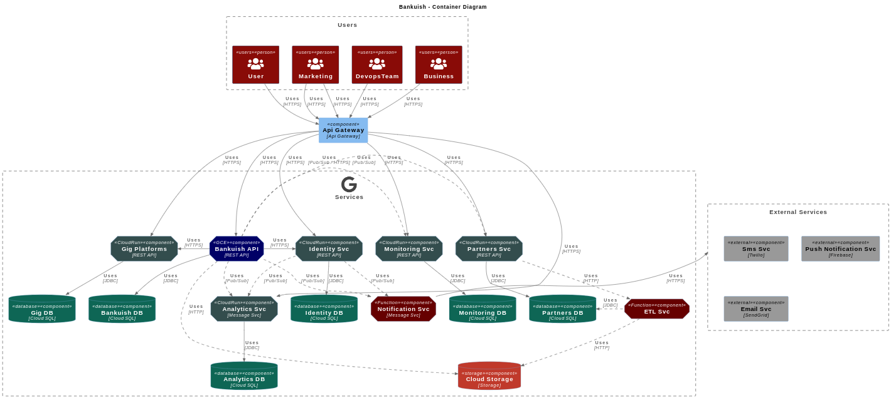
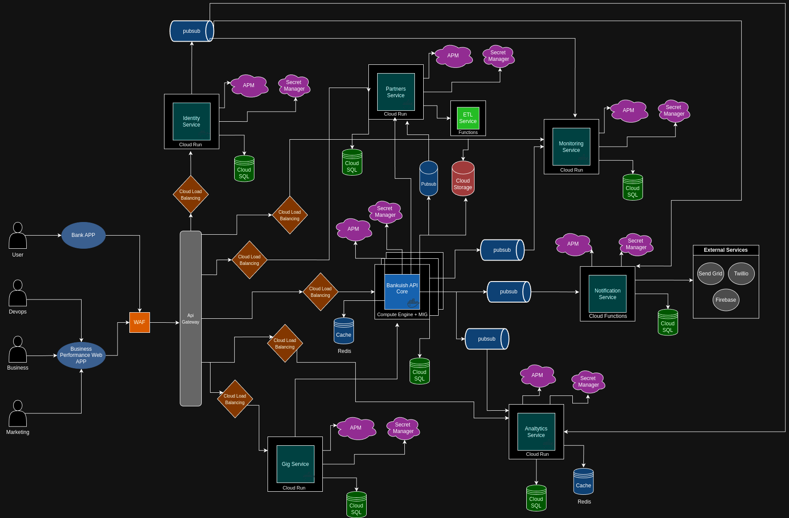

# Bankuish Systems

System designed to meet the requirements of Bankuish

## Key tools suggested for solution implementation

- Node v20.9.0
- NestJs
- Typescript
- TypeORM
- Jest
- Supertest
- Eslint
- Swagger
- Docker
- Docker Compose

## Main design patterns adopted

- Clean Code
- Single Responsibility Principle (SRP)
- Don't repeat yourself (DRY)
- Keep it simple, stupid (KISS)
- You aren't gonna need it (YAGNI)
- Repository
- Factories
- Dependency Injection
- Dependency Inversion
- Interface Segregation
- Unit Tests
- Integration Tests

## Code Architecture and Design

- Use the principles of clean architecture combined with some tactical elements of domain-driven design to implement all services that will compose the system. Suggested folder structure for the project:

### **1. Clean Architecture**

Organizes code into independent layers to ensure business logic remains isolated from technical details.

- **Application Layer**: Centralizes controllers, DTOs, and orchestration logic.
- **Domain Layer**: Focuses on business rules, including entities, use cases, and repository interfaces.
- **Infrastructure Layer**: Implements technical details like database and messaging.  
  **Benefit**: Facilitates technology swaps without impacting system logic.

### **2. Tactical Domain-Driven Design (DDD)**

Focused on handling domain complexity, organizing business logic modularly.

- **Entities and Value Objects**: Represent key domain concepts and rules.
- **Aggregates and Repositories**: Maintain consistency and abstract persistence.
- **Use Cases and Domain Services**: Isolate specific business scenarios and rules.  
  **Benefit**: Brings clarity and robustness to domain design.

### **3. Key Benefits**

- This approach aims to maximize the following aspects:

  - **Clear separation of responsibilities**: Reduces impact from requirement or technology changes.
  - **Ease of testing and maintenance**: Decoupled layers enable focused tests and quick adjustments.
  - **Flexibility and scalability**: The application adapts to increasing complexity and volume.
  - **Benefit**: Provides a solid foundation for long-term sustainability.

## System Architecture

### C4 Modeling

- Context Diagram

  

  - The diagram illustrates **Bankuish API** interactions with users and external systems. Users such as **User**, **Marketing**, **Business**, and **DevOps Team** utilize the API for functionalities, service monitoring, and performance metrics. The API integrates with external systems like **Gig Platforms** for data collection, **Partners Services** for CSV file processing, and **Identity Service** for authentication. It also connects to **Monitoring**, **Analytics**, and **Notification** services to track performance, generate metrics, and send notifications.

  - These interactions position the API as the central hub connecting users and services, delivering secure, monitorable, and data-driven functionalities.

- Container Diagram

  

  - This container diagram details the internal architecture of the **Bankuish API**, showing interactions between its components and external systems. **Bankuish API** comprises several microservices like **Gig Platforms**, **Identity Service**, **Monitoring Service**, **Analytics Service**, **Partners Service**, **Notification Service**, and **ETL Service**, each implemented as a separate container hosted in environments like **Google Cloud Run**, **Google Cloud Functions**, and **Google Compute Engine**.

  - The **Bankuish API** communicates with databases such as **Cloud SQL** for persistent storage and interacts with storage services like **Cloud Storage**. The API also integrates external services like **Twilio** (for SMS), **Firebase** (for push notifications), and **SendGrid** (for email). Users like **Marketing**, **Business**, and **DevOps** interact with the API via HTTPS or Pub/Sub, while the API consumes data from other platforms and processes information through message queues.

  - This modular structure enables robust scalability and flexibility, with each service handling a specific functionality and being independently changeable or updatable.

### Detailed System Design

The **Bankuish API** architecture is designed to ensure high availability, security, and scalability, aligned with the needs of a modern financial platform. Based on the context and container diagrams, this expanded solution includes essential components to optimize performance and traffic management.

The integration of an **API Gateway** centralizes external request management, enabling features like authentication, access control, rate limiting, and efficient routing to microservices. Additionally, the inclusion of a **WAF** (Web Application Firewall) strengthens application security, protecting against external threats like DDoS attacks and SQL injection.

The application benefits from a **Managed Instance Group** (MIG) combined with **Compute Engine**, enabling auto-scaling and load distribution among virtual machine instances, ensuring resilience and high availability for microservices. **Cloud Load Balancers** are added for other microservices running on **Cloud Run**, which already supports horizontal auto-scaling. **Secrets Manager** ensures secure storage of keys and credentials, accessible only by authorized services.

For monitoring and performance, the architecture includes an **APM** (Application Performance Monitoring) system, collecting metrics like latency, errors, and service throughput, allowing quick problem detection and continuous optimization. Solutions like **Datadog** and **New Relic** are recommended for distributed architectures in cloud environments, despite the additional cost. **Redis Cache** is used to store frequently accessed data, such as user sessions and query results, reducing database load and improving response speed.

The microservices structure—**Gig Platforms**, **Identity Service**, **Monitoring Service**, **Analytics Service**, **Notification Service**, and **Partners Service**—remains central to system operations. Communication between these services uses efficient protocols like **HTTPS** and **Pub/Sub**, while integration with databases like **Cloud SQL** and **Cloud Storage** is essential for data storage and retrieval. **Cloud SQL** was chosen for its horizontal and vertical scalability, as well as compatibility with leading relational databases like **Postgres**, **MySQL**, and **SQL Server**.

This modular and scalable architecture, now complemented with new components, ensures that the **Bankuish API** is secure, efficient, and capable of meeting the growing demands of integrated users and services.

## Main Flows

- **Batch File Processing**

  - The system will receive batch CSV files through specific endpoints from the **Bankuish API**.

  - The **Bankuish API** will send the files to storage and notify the **Partners Service** via Pub/Sub that the file is already in storage.

  - The **Partners Service** will trigger the ETL process to process these files, extract metadata and relevant business information, and then store the data in Cloud SQL.

  - To optimize performance, **Redis Cache** can be used to temporarily store data that needs to be accessed frequently.

  - After execution, the system sends notifications (via the **Notification Service**) about the completion of processing (emails, SMS, etc.).

- **Tracking the User Journey**

  - The user journey is tracked through integration with the **Identity Service** and the use of unique identifiers for each user.

  - The user journey is recorded through **Events** sent from the **Bankuish API** to the **Analytics Service**, using **Pub/Sub** to ensure asynchronous and efficient delivery.

  - With each user interaction (login, navigation, transactions, etc.), events are captured and sent to the monitoring system (**Application Performance Monitoring - APM**) and stored in the **Analytics Service**.

  - In the **Analytics Service**, **Cloud SQL** is used to persist journey data, enabling fast queries on user behavior.

- **Send Emails, SMS, and Push Notifications**

  - Based on events generated within the system (such as the completion of a transaction or a change in the status of an offer), **Notification Service** is triggered via Pub/Sub to send messages to users.

  - Depending on the notification type, the service chooses the appropriate channel (email, SMS, push notification) and interacts with specialized services for each of these channels.

  - The **Notification Service** can be configured to send emails via **SMTP** or integration with sending APIs (such as SendGrid, Mailgun, Twilio for SMS, or Firebase Cloud Messaging for Push Notifications).

  - The notification service can be monitored in real time using **APM** to track failures and delivery performance.

- **Track the Commercial Performance of Product Offers Accepted by Customers**

  - Product offers are managed and monitored by the **Analytics Service**, which collects data from each transaction made by customers.

  - The **Pub/Sub** system is used to register and distribute events whenever a customer accepts a product offer.

  - The **Analytics Service** aggregates offer acceptance data and sends this information to the **APM** system for performance monitoring, such as response time and conversions.

  - All collected data is stored in a structured format in **Cloud SQL** for later analysis and detailed reporting.

  - To optimize performance, **Redis Cache** can be used to temporarily store data that needs to be accessed frequently.

- **Track Partner Integration Performance, SLA Violations, and Service Interruptions**

  - Partner integration is monitored through the **Monitoring Service**. This service collects and stores metrics on partner interactions and the availability of external APIs.

  - For each partner integration, the system checks performance through specific events and records of **latency**, **errors**, and **downtime**.

  - **APM** and **WAF (Web Application Firewall)** can be used to ensure that violations of Service Level Agreements (SLAs) are detected and notified in real time.

  - The system stores this data in **Cloud SQL** to enable historical analysis of SLA violations and service interruptions.

  - If a partner's performance does not meet the required standards, automatic alerts will be generated and sent to the responsible team, along with possible corrective actions being taken.

## Development Methodology - Agile

1. **2-Week Sprints**:

   - Fixed cycles for consistent rhythm and frequent delivery of software increments.

2. **Kanban Board**:

   - Digital Kanban board for task progress visualization, promoting transparency and collaboration.

3. **Daily Stand-ups**:

   - 15-minute meetings to review progress, discuss blockers, and align next steps.

4. **Sprint Reviews and Retrospectives**:

   - Reviews with stakeholders to present results, followed by retrospectives for process adjustments.

5. **Value-Based Prioritization**:

   - Tasks prioritized by business value, complexity, and impact.

6. **Value-Based Prioritization**:

   - Tasks will be prioritized based on their business value, complexity, and impact, ensuring the team focuses on the most important activities and maximizes the value delivered.

7. **Performance Evaluations**:

   - Monitoring performance metrics and indicators, such as cycle time and user feedback, to identify optimization opportunities and adjust the development process.

8. **Open and Transparent Communication**:

   - Promoting continuous and collaborative communication among team members and stakeholders, ensuring alignment and product quality.

9. **Test and Deploy Automation**:
   - Implementing automation for unit tests, continuous integration (CI), and automatic deployments, ensuring software integrity and increasing delivery speed and reliability.

## Development Team

### Phase 1: Project Kickoff (0-3 months)

- Build the foundation of the project, validate the architecture, and start development.

- 1 Technical Lead (Tech Lead/Software Architect)
- 1 Backend Developer/Engineer
- 1 Quality Engineer (QA)
- 1 DevOps/SRE Engineer
- 1 Product Owner
- 1 Scrum Master

### Phase 2: Initial Scale (4-6 months)

- Expand functionality and handle initial integrations with partners.

- +1 Developer/Engineer (total: 2)
- +1 DevOps/SRE Engineer (total: 2)

### Phase 3: Beta Launch (7-12 months)

- Ensure a stable and functional version for beta users.

- +1 Data Engineer
- +1 Technical Support Analyst (focused on initial support for users and partners)

### Phase 4: Growth and Stabilization (12-18 months)

- Prepare the system for official launch, focusing on scalability and support.

- +2 Backend Developers (total: 4)
- +1 Automated QA Engineer (total: 2 QAs)
